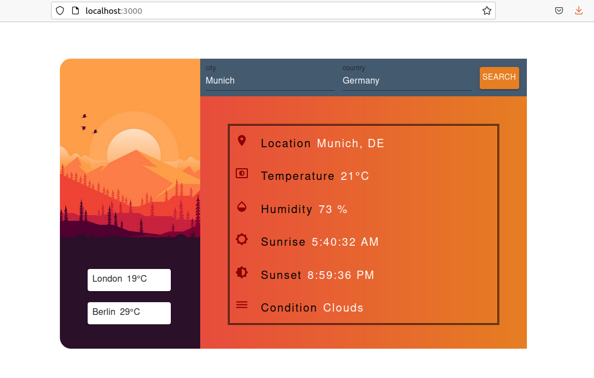
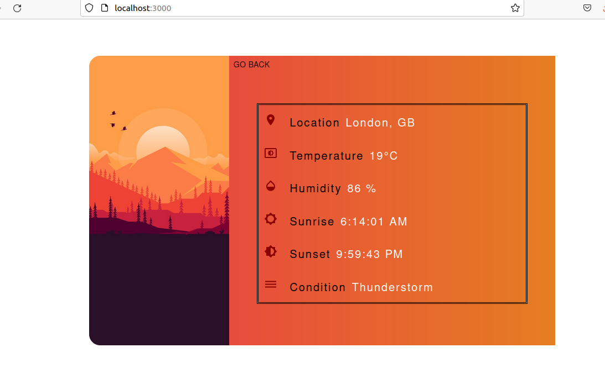

# weather-app

### Steps to run application:                                      
1 git clone               
2 change directory to project directory               
3 npm install                  
4 npm start   

### Project Approach to built this application:                      
1 Built simple front end component Weather.js                               
2 Hardcoded some values to achieve minimal UI.                  
3 Built async funtionality to fetch dynamic data from OpenWeather API.                          
4 Built (Form and Details) components to handle complexity in the application.                  
5 Use Material UI library to get predefined component.    
6 Manual testing and refactoring of code
7 Added few funtional tests              

### Improvements:
1 Could use React-router-dom to manage different routes to render components                       
2 Should have created more smaller components to add animations.                             
3 Following design systems approach would be a good idea.

 

 

 
